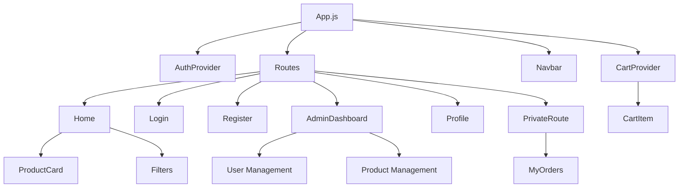
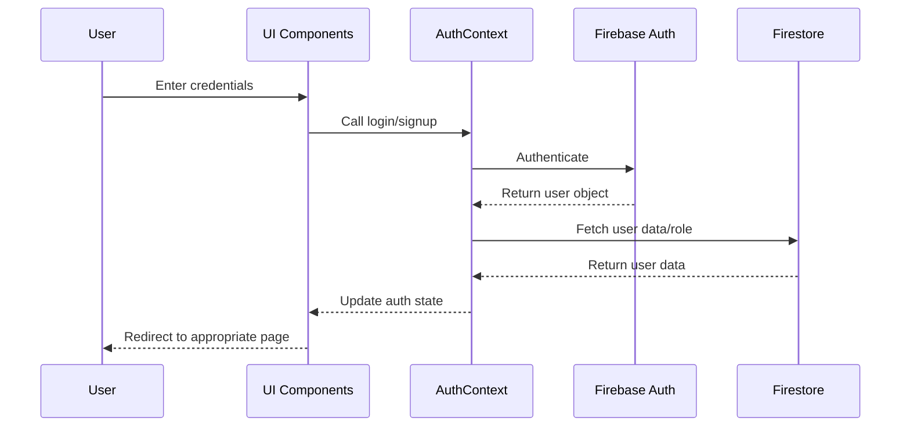
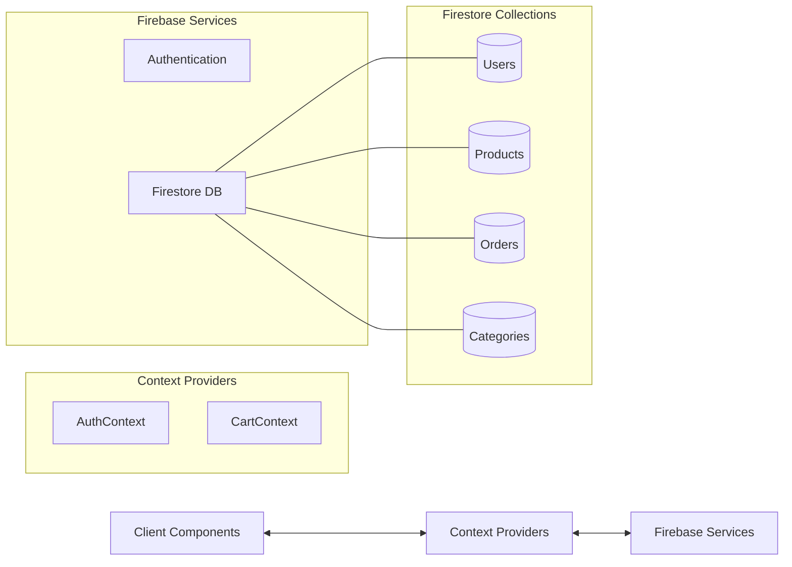
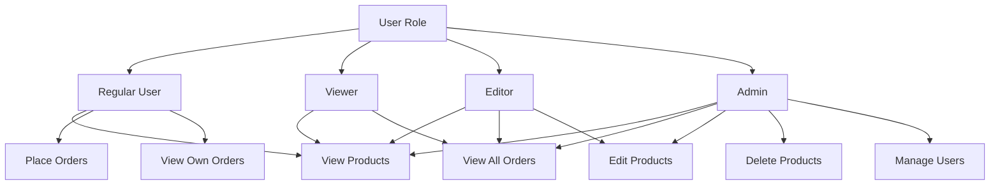

# E-Commerce Application Architecture

This document outlines the architecture of our e-commerce application using Mermaid diagrams.

## Component Structure

## Authentication Flow

## Data Flow

## Role-Based Access Control

